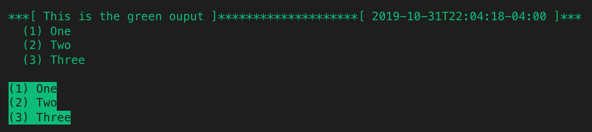

# aire-console

Light-weight native `console` object wrapper for grouping and enumerating colorful outputs.

Supported text colors:
  - `red`
  - `green`
  - `yellow`
  - `blue`
  - `lightblue`
  - `magenta`
  - `cyan`
  - `gray`
  - `white`
  
Supported text formats: 
  - `bold`
  - `italic`
  - `underline`
  - `fill`

Turn off/on output
  - `toggle`

## Installation

Using npm:
```
$ npm install --save aire-console
```

Using yarn:
```
$ yarn add aire-console
```

## Usage

Javascript
``` js
const Console = require('aire-console').Console;
```

Typescript
``` ts
import { Console } from 'aire-console';
```

``` js
/*** each output function can take any number of arguments ***/
Console.red().log('This is the red ouput', 'One', 'Two', 'Three');
Console.red().bold('This is the red ouput', 'One', 'Two', 'Three');

// output grouping date format - https://momentjs.com
// defaults to '2019-10-16T23:30:08-04:00' format if not explicitly set
Console.red().setDateFormat('MMMM Do YYYY - h:mm:ss a');
Console.red().italic('This is the red ouput', 'One', 'Two', 'Three');
Console.red().underline('This is the red ouput', 'One', 'Two', 'Three');

// exclude output grouping header, pass null as first argument
Console.red().fill(null, 'One', 'Two', 'Three');
```


``` js
/*** each output function can take any number of arguments ***/
Console.magenta().log('This is the magenta ouput', 'One', 'Two', 'Three');
Console.magenta().bold('This is the magenta ouput', 'One', 'Two', 'Three');

// output grouping date format - https://momentjs.com
// defaults to '2019-10-16T23:30:08-04:00' format if not explicitly set
Console.magenta().setDateFormat('llll'); 
Console.magenta().italic('This is the magenta ouput', 'One', 'Two', 'Three');
Console.magenta().underline('This is the magenta ouput', 'One', 'Two', 'Three');

// exclude output grouping header, pass null as first argument
Console.magenta().fill(null, 'One', 'Two', 'Three');
```


``` js
/*** each output function can take any number of arguments ***/
Console.yellow().log('This is the yellow ouput', 'One', 'Two', 'Three');
Console.yellow().bold('This is the yellow ouput', 'One', 'Two', 'Three');

// output grouping date format - https://momentjs.com
// defaults to '2019-10-16T23:30:08-04:00' format if not explicitly set
Console.yellow().setDateFormat('MMM Do YY');
Console.yellow().italic('This is the yellow ouput', 'One', 'Two', 'Three');
Console.yellow().underline('This is the yellow ouput', 'One', 'Two', 'Three');

// exclude output grouping header, pass null as first argument
Console.yellow().fill(null, 'One', 'Two', 'Three');
```


```js
/*** each output function can take any number of arguments ***/
Console.green().log('This is the green ouput', 'One', 'Two', 'Three');

// turn off logging
Console.green().toggle(); // any invocations beyond here will not be output
Console.green().bold('This is the green ouput', 'One', 'Two', 'Three');
Console.green().setDateFormat('MMM Do YY');
Console.green().italic('This is the green ouput', 'One', 'Two', 'Three');
Console.green().underline('This is the green ouput', 'One', 'Two', 'Three');

// turn on logging
Console.green().toggle(); // resume output
Console.green().fill(null, 'One', 'Two', 'Three');
```



