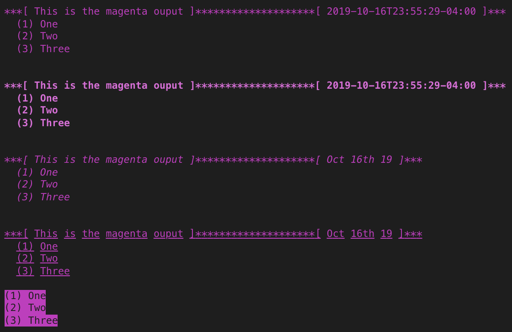

# aire-console

Light-weight native `console` object wrapper for grouping and enumerating colorful outputs. Supported text colors: `red`, `green`, `yellow`, `blue`, `lightblue`, `magenta`,`cyan`,`white`,`gray`. Supported text formats: `bold`, `itatlic`, `underline`, `fill`.

## Installation

Using npm:
```
$ npm install --save aire-console
```

Using yarn:
```
$ yarn add aire-console
```

## Usage

Javascript
``` js
const Console = require('aire-console').Console;
```

Typescript
``` ts
import { Console } from 'aire-console';
```

``` js
Console.red().log('This is the red ouput', 'One', 'Two', 'Three');
Console.red().bold('This is the red ouput', 'One', 'Two', 'Three');
// output grouping date format - https://momentjs.com
Console.red().setDateFormat('MMMM Do YYYY - h:mm:ss a');
Console.red().italic('This is the red ouput', 'One', 'Two', 'Three');
Console.red().underline('This is the red ouput', 'One', 'Two', 'Three');
Console.red().fill(null, 'One', 'Two', 'Three');
```


``` js
Console.magenta().log('This is the magenta ouput', 'One', 'Two', 'Three');
Console.magenta().bold('This is the magenta ouput', 'One', 'Two', 'Three');
// output grouping date format - https://momentjs.com
Console.magenta().setDateFormat('llll');
Console.magenta().italic('This is the magenta ouput', 'One', 'Two', 'Three');
Console.magenta().underline('This is the magenta ouput', 'One', 'Two', 'Three');
Console.magenta().fill(null, 'One', 'Two', 'Three');
```


``` js
Console.yellow().log('This is the yellow ouput', 'One', 'Two', 'Three');
Console.yellow().bold('This is the yellow ouput', 'One', 'Two', 'Three');
// output grouping date format - https://momentjs.com
Console.yellow().setDateFormat('MMM Do YY');
Console.yellow().italic('This is the yellow ouput', 'One', 'Two', 'Three');
Console.yellow().underline('This is the yellow ouput', 'One', 'Two', 'Three');
Console.yellow().fill(null, 'One', 'Two', 'Three');
```

